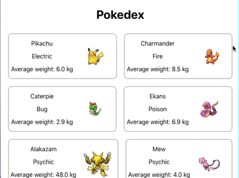

# Componentes React

## Content

**Agora vamos fazer este exercício de fixação!**

```js
import React from 'react';

class Image extends React.Component {
  render() {
    return ;
  }
}

export default Image;
```

Crie uma aplicação ***React*** na sua máquina via `create-react-app` com o nome `fixation-exercises-11-2` . Crie um arquivo `Image.js` no diretório `src` do projeto e copie para esse arquivo o código escrito acima. Uma vez feito isso tudo, responda:  

1. Qual o nome do componente declarado acima?  

2. Chame o componente `Image` , de forma que seja mostrada esta [imagem](https://cdn.pixabay.com/photo/2017/02/20/18/03/cat-2083492_1280.jpg), ou o texto `Cute cat staring` , caso a imagem não consiga ser carregada.

**Agora, realize este exercício de fixação:**  

Suponha que você abra uma aplicação ***React*** e se depare com os seguintes componentes:

```js
// arquivo Order.js
import React from 'react';

class Order extends React.Component {
  render() {
    const { user, product, price } = this.props.order;

    return (
      <div className="order">
        <p> {user} bought {product} for {price.value} {price.currency} </p>
      </div>
    );
  }
}

export default Order;
```

```js
// arquivo App.js, criado pelo create-react-app, modificado
import React from 'react';
import './App.css';
import Order from './Order';

class App extends React.Component {
  render() {
    const headphone = {
      id: 102,
      user: "cena@gmail.com",
      product: "Razer Headphone",
      price: {
        value: 99.99,
        currency: "dollars"
      }
    };

    const energyDrink = {
      id: 77,
      user: "cena@gmail.com",
      product: "Monster 500mL",
      price: {
        value: 9.99,
        currency: "dollars"
      }
    };

    return (
      <div className="App">
        <h1> Orders recently created </h1>
         {/*  adicione os componentes aqui */}
      </div>
    );
  }
}

export default App;
```

Agora, responda ao seguinte, no que diz respeito à composição de componentes:  

* O que o componente `App` é em relação a `Order` ?  

* Complete o código acima de forma que os pedidos referentes aos produtos `headphone` e `energyDrink` sejam filhos de `App` .  

**Agora vamos fazer este exercício de fixação:**  

Lembra do código de exemplo da seção anterior, referente à composição de componentes? Crie os componentes `Image , UserProfile e App` no diretório `src` do projeto `fixation-exercises-11-2` , e vamos olhar especificamente para o arquivo `App.js` :  

```js
// arquivo App.js, criado pelo create-react-app, modificado
import React from 'react';
import './App.css';
import UserProfile from './UserProfile';

class App extends React.Component {
  render() {
    const joao = {
      id: 102,
      name: "João",
      email: "joao@gmail.com",
      avatar: "https:\/\/cdn.pixabay.com/photo/2016/08/20/05/38/avatar-1606916_640.png"
    };

    const amelia = {
      id: 77,
      name: "Amélia",
      email: "amelia@gmail.com",
      avatar: "https:\/\/cdn.pixabay.com/photo/2017/01/31/13/05/cameo-2023867_640.png"
    };

    return (
      <div className="App">
        <UserProfile user={joao} />
        <UserProfile user={amelia} />
      </div>
    );
  }
}

export default App;
```

O componente `App` possui dois componentes `UserProfile` como filho. Que tal gerar esses componentes filhos dinamicamente? Isso poderia ser feito da seguinte forma:  

```js
// arquivo App.js, criado pelo create-react-app, modificado
import React from 'react';
import './App.css';
import UserProfile from './UserProfile';

class App extends React.Component {
  render() {
    const users = [
      {
        id: 102,
        name: "João",
        email: "joao@gmail.com",
        avatar: "https:\/\/cdn.pixabay.com/photo/2016/08/20/05/38/avatar-1606916_640.png"
      },
      {
        id: 77,
        name: "Amélia",
        email: "amelia@gmail.com",
        avatar: "https:\/\/cdn.pixabay.com/photo/2017/01/31/13/05/cameo-2023867_640.png"
      }
    ];

    return (
      <div className="App">
        {users.map(user => <UserProfile user={user} />)}
      </div>
    );
  }
}

export default App;
```

Entretanto, a geração dinâmica dos componentes está incompleta, haja vista que é preciso passar uma `key` para `UserProfile` . Você pode averiguar isso copiando o código acima e entrando no console do *Google Chrome* , que lá vai estar presente um `warning` levantado pelo ***React*** .  

Dito isso, altere a chamada do componente de `UserProfile` de forma que a lista seja gerada dinamicamente de maneira adequada.  

## Exercises

Crie um novo projeto utilizando `npx create-react-app my-pokedex`  

Para realizar esse exercício, crie um arquivo chamado `data.js` no diretório `.src/` do projeto que você acabou de criar. Copie para esse arquivo o seguinte conteúdo:  

```js
const pokemons = [
  {
      id: 25,
      name: "Pikachu",
      type: 'Electric',
      averageWeight: {
          value: 6.0,
          measurementUnit: "kg"
      },
      image: "https:\/\/cdn2.bulbagarden.net/upload/b/b2/Spr_5b_025_m.png",
      moreInfo: "https:\/\/bulbapedia.bulbagarden.net/wiki/Pikachu_(Pok%C3%A9mon)"
  },
  {
      id: 4,
      name: "Charmander",
      type: 'Fire',
      averageWeight: {
          value: 8.5,
          measurementUnit: "kg"
      },
      image: "https:\/\/cdn2.bulbagarden.net/upload/0/0a/Spr_5b_004.png",
      moreInfo: "https:\/\/bulbapedia.bulbagarden.net/wiki/Charmander_(Pok%C3%A9mon)"
  },
  {
      id: 10,
      name: "Caterpie",
      type: 'Bug',
      averageWeight: {
          value: 2.9,
          measurementUnit: "kg"
      },
      image: "https:\/\/cdn2.bulbagarden.net/upload/8/83/Spr_5b_010.png",
      moreInfo: "https:\/\/bulbapedia.bulbagarden.net/wiki/Caterpie_(Pok%C3%A9mon)"
  },
  {
      id: 23,
      name: "Ekans",
      type: 'Poison',
      averageWeight: {
          value: 6.9,
          measurementUnit: "kg"
      },
      image: "https:\/\/cdn2.bulbagarden.net/upload/1/18/Spr_5b_023.png",
      moreInfo: "https:\/\/bulbapedia.bulbagarden.net/wiki/Ekans_(Pok%C3%A9mon)"
  },
  {
      id: 65,
      name: "Alakazam",
      type: 'Psychic',
      averageWeight: {
          value: 48.0,
          measurementUnit: "kg"
      },
      image: "https:\/\/cdn2.bulbagarden.net/upload/8/88/Spr_5b_065_m.png",
      moreInfo: "https:\/\/bulbapedia.bulbagarden.net/wiki/Alakazam_(Pok%C3%A9mon)"
  },
  {
      id: 151,
      name: "Mew",
      type: 'Psychic',
      averageWeight: {
          value: 4.0,
          measurementUnit: "kg"
      },
      image: "https:\/\/cdn2.bulbagarden.net/upload/4/43/Spr_5b_151.png",
      moreInfo: "https:\/\/bulbapedia.bulbagarden.net/wiki/Mew_(Pok%C3%A9mon)"
  },
  {
      id: 78,
      name: "Rapidash",
      type: 'Fire',
      averageWeight: {
          value: 95.0,
          measurementUnit: "kg"
      },
      image: "https:\/\/cdn2.bulbagarden.net/upload/5/58/Spr_5b_078.png",
      moreInfo: "https:\/\/bulbapedia.bulbagarden.net/wiki/Rapidash_(Pok%C3%A9mon)"
  },
  {
      id: 143,
      name: "Snorlax",
      type: 'Normal',
      averageWeight: {
          value: 460.0,
          measurementUnit: "kg"
      },
      image: "https:\/\/cdn2.bulbagarden.net/upload/4/40/Spr_5b_143.png",
      moreInfo: "https:\/\/bulbapedia.bulbagarden.net/wiki/Snorlax_(Pok%C3%A9mon)"
  },
  {
      id: 148,
      name: "Dragonair",
      type: 'Dragon',
      averageWeight: {
          value: 16.5,
          measurementUnit: "kg"
      },
      image: "https:\/\/cdn2.bulbagarden.net/upload/2/2c/Spr_5b_148.png",
      moreInfo: "https:\/\/bulbapedia.bulbagarden.net/wiki/Dragonair_(Pok%C3%A9mon)"
  }
];

export default pokemons;
```

Você pode usar a imaginação para estilizar a sua aplicação. Entretanto, é **obrigatório** que você implemente **pelo menos** estes dois componentes:  

1. `Pokemon` : como o próprio nome diz, esse componente representa um pokemon. Esse componente recebe como entrada um objeto que contém informações referentes a um pokemon específico. Esse componente precisa retornar as seguintes informações obrigatórias para serem mostradas para quem usar a aplicação, essas informações devem ser validadas utilizando PropTypes:  

* nome do pokemon;  

* tipo do pokemon;  

* peso médio do pokemon, acompanhado da unidade de medida usada;  

* imagem do pokemon.  

2. `Pokedex` : esse componente representa a enciclopédia de pokemons. Esse componente recebe como entrada uma lista de pokemons para serem mostrados na tela. Para cada um desses pokemons recebidos, `Pokedex` chama o componente `Pokemon` .  

Segue uma sugestão de implementação da aplicação:  

