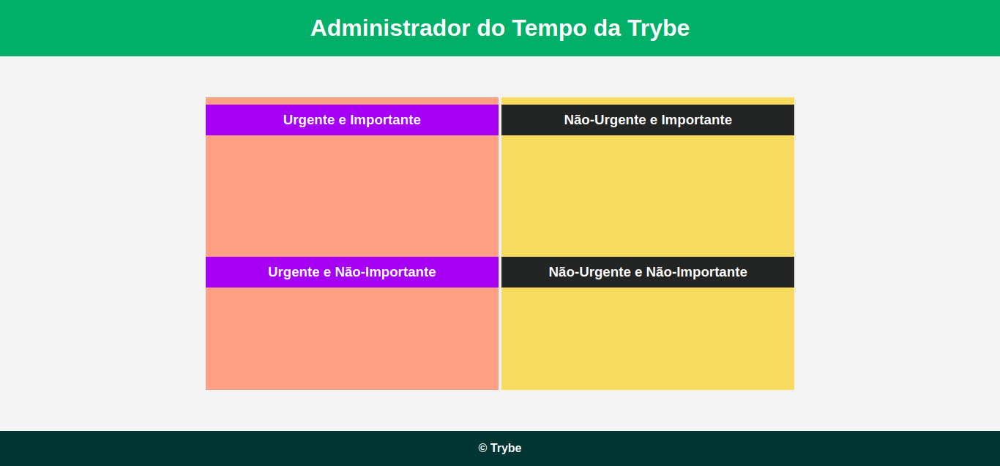

# JavaScript - DOM e seletores

## Conteúdos

### Parte II - Seletores de elementos

```html
<!DOCTYPE html>
<html>
  <body>
    <header>
      <h2 id="page-title">Título</h2>
      <p id="paragraph">Dê uma cor para este parágrafo!</p>
      <h4 id="subtitle">Subtítulo</h4>
      <p id="second-paragraph">Segundo parágrafo!</p>
    </header>
    <script>
      const paragraph = document.getElementById("paragraph");
      paragraph.style.color = "red";
    </script>
  </body>
</html>
```

1. Recupere o elemento que contém o título da página e faça algo com ele, como alterá-lo para o nome do seu filme favorito.
2. Agora recupere o segundo parágrafo e use sua criatividade para alterá-lo.
3. Por fim, recupere o subtítulo e altere-o também.
---
Utilizando o mesmo template de exercício anterior:
1. Adicione uma classe igual para os dois parágrafos.
2. Recupere os seus parágrafos via código JavaScript , usando a função getElementsByClassName ;
3. Altere algum estilo do primeiro deles.
4. Recupere o subtítulo e altere a cor dele usando a função getElementsByTagName .

### Parte III - Qual seletor usar?

Vamos consolidar a manipulação dos elementos `HTML` , colocando a cor do Administrador de Tempo da Trybe como na imagem abaixo usando apenas o JavaScript!



```html
<!DOCTYPE html>
<html lang="pt-br">
  <head>
    <meta charset="UTF-8">
    <meta name="viewport" content="width=device-width, initial-scale=1.0">
    <link rel="stylesheet" href="style.css">
    <title>Administrador do Tempo</title>
  </head>
  <body id="container">
    <header id="header-container">
      <h1>Administrador do Tempo da Trybe</h1>
    </header>

    <section class="emergency-tasks">
      <div>
        <h3>Urgente e Importante</h3>
      </div>
      <div>
        <h3>Urgente e Não-Importante</h3>
      </div>
    </section>

    <section class="no-emergency-tasks">
      <div>
        <h3>Não-Urgente e Importante</h3>
      </div>
      <div>
        <h3>Não-Urgente e Não-Importante</h3>
      </div>
    </section>

    <footer id="footer-container">
      <div>&copy; Trybe</div>
    </footer>
    <script src="script.js"></script>
  </body>
</html>
```
CSS
```css
* {
  margin: 0;
}

#container {
  font-family: Verdana, Geneva, Tahoma, sans-serif;
  text-align: center;
}

#header-container {
  color: white;
  padding: 20px;
}

.emergency-tasks {
  display: inline-block;
  height: 400px;
  margin: 56px 0;
  width: 400px;
}

.emergency-tasks div {
  height: 198px;
}
.emergency-tasks h3 {
  color: white;
  margin-top: 10px;
  padding: 10px;
}

.no-emergency-tasks {
  display: inline-block;
  height: 400px;
  width: 400px;
}

.no-emergency-tasks div {
  height: 198px;
}

.no-emergency-tasks h3 {
  color: white;
  margin-top: 10px;
  padding: 10px;
}

#footer-container {
  color: white;
  font-weight: 700;
  padding: 15px;
  text-align: center;
}
```

## Exercícios

### Funções de manipulação do DOM

```html
<!DOCTYPE html>
<html>
  <head>
    <meta charset="UTF-8" />
    <meta name="viewport" content="width=device-width" />
    <title>Exercício 5.1</title>
    
    <style>
      main, section {
        border-color: black;
        border-style: solid;
      }

      .title {
        text-align: center;
      }

      .main-content {
        background-color: yellow;
      }

      .main-content .center-content {
        background-color: red;
        width: 50%;
        margin: 0 auto;
      }

      .main-content .center-content p {
        font-style: italic;
      }
    </style>
  </head>
  <body>
    <header> 
      <h1 class="title">Exercício 5.1 - JavaEscripito </h1>
    </header>    
    <main class="main-content">
      <section class="center-content">
        <p>Texto padrão do nosso site</p>
        <p>-----</p>
        <p>Trybe</p>
      </section>
    </main>
    <script>
        /*
        Aqui você vai modificar os elementos já existentes utilizando apenas as funções:
        - document.getElementById()
        - document.getElementsByClassName()
        - document.getElementsByTagName()
 Crie uma função que mude o texto na tag <p> para uma descrição de como você se vê daqui a 2 anos. (Não gaste tempo pensando no texto e sim realizando o exercício)
 Crie uma função que mude a cor do quadrado amarelo para o verde da Trybe (rgb(76,164,109)).
 Crie uma função que mude a cor do quadrado vermelho para branco.
 Crie uma função que corrija o texto da tag <h1>.
 Crie uma função que modifique todo o texto da tag <p> para maiúsculo.
 Crie uma função que exiba o conteúdo de todas as tags <p> no console.
        */
    </script>
  </body>
</html>
```