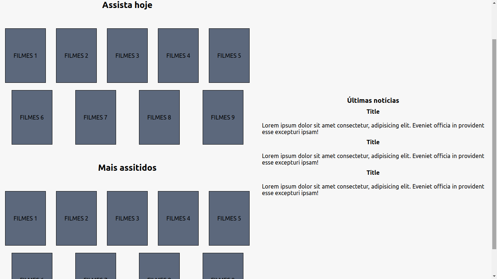
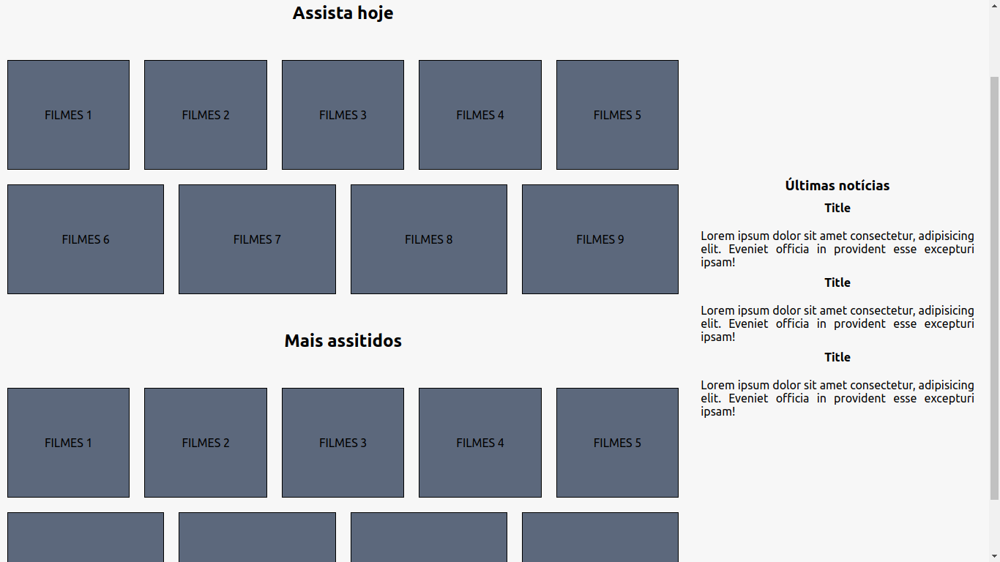

# CSS Flexbox - Parte 2

## Conteúdos

### Propriedade: align-self

Copie o código abaixo e no seu editor de código, teste as possibilidades para a propriedade `align-self` .

```
<!DOCTYPE html>
<html lang="pt">
  <head>
    <meta charset="UTF-8">
    <meta name="viewport" content="width=device-width, initial-scale=1.0">
    <title>CSS FLEXBOX - ALIGN SELF</title>
    <style>
      .container {
        border: 1px solid black;
        display: flex;
        height: 300px;
        margin: auto;
        width: 500px;
      }

      .keep {
        align-self: center;
        background-color: #FAA488;
        display: flex;
        justify-content: center;
        width: 150px;
        list-style: none;
      }

      .change {
        /* Altere a propriedade align-self. */
        align-self: center;
        background-color: #FBD26A;
        display: flex;
        justify-content: center;
        width: 200px;
        list-style: none;
      }

    </style>
  </head>
  <body>
    <ul class="container">
      <li class="keep">REFERÊNCIA</li>
      <li class="change">ELEMENTO TESTE</li>
      <li class="keep">REFERÊNCIA</li>
    </ul>
  </body>
</html>
```

### Propriedade: order

Copie o código abaixo e teste as possibilidades de ordenação.

```
<!DOCTYPE html>
<html lang="pt">
  <head>
    <meta charset="UTF-8">
    <meta name="viewport" content="width=device-width, initial-scale=1.0">
    <title>CSS FLEXBOX - ORDER</title>
    <style>
      .container {
        border: 1px solid black;
        display: flex;
        height: 50px;
        margin: auto;
        width: 500px;
      }

      .box {
        align-items: center;
        display: flex;
        justify-content: center;
        width: 125px;
      }

      .one {
        background-color: #FBD26A;
        display: flex;
        /* Altere a propriedade order. */
        order: 1;
        list-style: none;
      }

      .two {
        background-color: #FAA488;
        display: flex;
        /* Altere a propriedade order. */
        order: 2;
        list-style: none;
      }

      .three {
        background-color: #9069EF;
        display: flex;
        /* Altere a propriedade order. */
        order: 3;
        list-style: none;
      }

      .four {
        background-color: #006472;
        display: flex;
        /* Altere a propriedade order. */
        order: 4;
        list-style: none;
      }

    </style>
  </head>
  <body>
    <ul class="container">
      <li class="box one">1</li>
      <li class="box two">2</li>
      <li class="box three">3</li>
      <li class="box four">4</li>
    </ul>
  </body>
</html>
```

### Propriedades: flex-grow, flex-shrink, flex-basis

1. Teste as possibilidades para a propriedade `flex-grow` .

```
<!DOCTYPE html>
<html lang="pt">
  <head>
    <meta charset="UTF-8">
    <meta name="viewport" content="width=device-width, initial-scale=1.0">
    <title>CSS FLEXBOX - ORDER</title>
    <style>
      .container {
        display: flex;
        height: 50px;
        margin: auto;
        width: 100%;
      }

      .box {
        align-items: center;
        display: flex;
        justify-content: center;
      }

      .one {
        background-color: #FBD26A;
        display: flex;
        /* Altere a propriedade grow. */
        flex-grow: 1;
        list-style: none;
      }

      .two {
        background-color: #FAA488;
        display: flex;
        /* Altere a propriedade grow. */
        flex-grow: 1;
        list-style: none;
      }

      .three {
        background-color: #9069EF;
        display: flex;
        /* Altere a propriedade grow. */
        flex-grow: 1;
        list-style: none;
      }

      .four {
        background-color: #006472;
        display: flex;
        /* Altere a propriedade grow. */
        flex-grow: 1;
        list-style: none;
      }

    </style>
  </head>
  <body>
    <ul class="container">
      <li class="box one">1</li>
      <li class="box two">2</li>
      <li class="box three">3</li>
      <li class="box four">4</li>
    </ul>
  </body>
</html>
```

2. Teste as possibilidades para a propriedade `flex-shrink` .

```
<!DOCTYPE html>
<html lang="pt">
  <head>
    <meta charset="UTF-8">
    <meta name="viewport" content="width=device-width, initial-scale=1.0">
    <title>CSS FLEXBOX - SHRINK</title>
    <style>
      .container {
        display: flex;
        height: 50px;
        margin: auto;
        width: 100%;
      }

      .box {
        align-items: center;
        display: flex;
        justify-content: center;
        flex-basis: 500px;
        flex-grow: 0;
        flex-shrink: 1;
      }

      .one {
        background-color: #FBD26A;
        display: flex;
        /* Altere a propriedade shrink. */
        flex-shrink: 1;
        list-style: none;
      }

      .two {
        background-color: #FAA488;
        display: flex;
        /* Altere a propriedade shrink. */
        flex-shrink: 1;
        list-style: none;
      }

      .three {
        background-color: #9069EF;
        display: flex;
        /* Altere a propriedade shrink. */
        flex-shrink: 1;
        list-style: none;
      }

      .four {
        background-color: #006472;
        display: flex;
        /* Altere a propriedade shrink. */
        flex-shrink: 1;
        list-style: none;
      }

    </style>
  </head>
  <body>
    <ul class="container">
      <li class="box one">1</li>
      <li class="box two">2</li>
      <li class="box three">3</li>
      <li class="box four">4</li>
    </ul>
  </body>
</html>
```

3. Teste as possibilidades para a propriedade `flex-basis` .

```
<!DOCTYPE html>
<html lang="pt">
  <head>
    <meta charset="UTF-8">
    <meta name="viewport" content="width=device-width, initial-scale=1.0">
    <title>CSS FLEXBOX - BASIS</title>
    <style>
      .container {
        display: flex;
        height: 50px;
        margin: auto;
        width: 100%;
      }

      .box {
        align-items: center;
        display: flex;
        justify-content: center;
        /* Altere a propriedade flex-basis */
        flex-basis: 500px;
        flex-grow: 0;
        flex-shrink: 1;
      }

      .one {
        background-color: #FBD26A;
        list-style: none;
      }

      .two {
        background-color: #FAA488;
        list-style: none;
      }

      .three {
        background-color: #9069EF;
        list-style: none;
      }

      .four {
        background-color: #006472;
        list-style: none;
      }

    </style>
  </head>
  <body>
    <ul class="container">
      <li class="box one">1</li>
      <li class="box two">2</li>
      <li class="box three">3</li>
      <li class="box four">4</li>
    </ul>
  </body>
</html>
```

## Exercícios

### Parte I

```
<!DOCTYPE html>
<html lang="pt">
  <head>
    <meta charset="UTF-8">
    <meta name="viewport" content="width=device-width, initial-scale=1.0">
    <title>TRYFLIX</title>
    <link rel="stylesheet" href="./style.css">
  </head>
  <body>
    <header class="header-container">
      <nav class="menu-container">
        <ul>
          <li>Cadastre-se</li>
          <li>Conecte-se</li>
          <li>Sobre</li>
        </ul>
      </nav>
      <section class="logo-container">
        
      </section>
    </header>

  </body>
</html>
```
```
* {
  margin: 0;
  padding: 0;
  box-sizing: border-box;
  font-family: 'Ubuntu';
}

body {
  background-color: rgb(247, 247, 247);
}

.header-container {
  background-color: #5C687C;
  display: flex;
}

.logo-container {
  display: flex;
  justify-content: center;
}

.menu-container {
  display: flex;
}

.menu-container ul {
  display: flex;
  justify-content: space-around;
  width: 100%;
}

.menu-container li {
  color: white;
  font-weight: 500;
  font-size: 1.3rem;
  list-style: none;
  margin-right: 10px;
}
```

### Parte 1

1. Adicione uma propriedade que defina o tamanho `Flexbox` base para o container da imagem `268px` e para o container do menu `500px` . Após aplicar as propriedades o `header` deverá estar similar a imagem abaixo:


2. Adicione uma propriedade `Flexbox` que modifique a **ordem** em que a logomarca e os itens do menu aparecem na tela. Após aplicar a propriedade o `header` deverá estar similar a imagem abaixo:


3. dicione uma propriedade `Flexbox` que modifique o tamanho padrão do container do menu quando a largura da página for maior que `768px` . Após aplicar a propriedade o `header` deverá estar similar a imagem abaixo:


4. Utilize a propriedade `align-self` no elemento correto para que o `header` da página tenha o seguinte comportamento:


### Parte II
```
    <main class="main-container">
      <section class="movie-container">
        <section>
          <h2>Assista hoje</h2>
          <div class="card-container">
            <div>FILMES 1</div>
            <div>FILMES 2</div>
            <div>FILMES 3</div>
            <div>FILMES 4</div>
            <div>FILMES 5</div>
            <div>FILMES 6</div>
            <div>FILMES 7</div>
            <div>FILMES 8</div>
            <div>FILMES 9</div>
          </div>
        </section>
        <article>
          <h2>Mais assitidos</h2>
          <div class="card-container">
            <div>FILMES 1</div>
            <div>FILMES 2</div>
            <div>FILMES 3</div>
            <div>FILMES 4</div>
            <div>FILMES 5</div>
            <div>FILMES 6</div>
            <div>FILMES 7</div>
            <div>FILMES 8</div>
            <div>FILMES 9</div>
          </div>
        </article>
      </section>
  <aside class="aside-container">
    <h3>Últimas notícias</h3>

    <h4>Title</h4>
    <p>Lorem ipsum dolor sit amet consectetur, adipisicing elit. Eveniet officia in provident esse excepturi ipsam!</p>

    <h4>Title</h4>
    <p>Lorem ipsum dolor sit amet consectetur, adipisicing elit. Eveniet officia in provident esse excepturi ipsam!</p>

    <h4>Title</h4>
    <p>Lorem ipsum dolor sit amet consectetur, adipisicing elit. Eveniet officia in provident esse excepturi ipsam!</p>
  </aside>
</main>
```

```
.main-container {
  display: flex;
  flex-wrap: wrap;
}

.movie-container {
  display: flex;
  flex-direction: column;
}

.movie-container h2 {
  margin: 40px 0;
  text-align: center;
}

.card-container {
  display: flex;
  flex-wrap: wrap;
  justify-content: space-around;
}

.card-container div {
  align-items: center;
  background-color: #5C687C;
  border: black solid 1px;
  display: flex;
  height: 150px;
  justify-content: center;
  margin: 10px;
}

.aside-container {
  display: flex;
  flex-direction: column;
  margin: 20px;
}

.aside-container h3, h4 {
  margin-bottom: 10px;
  text-align: center;
}

.aside-container p {
  margin: 10px 0;
  text-align: justify;
}
```

### Parte 2

1. Aplique uma base de `350px` para seu container `aside` . Deverá ficar similar a imagem abaixo:

2. Aplique um alinhamento para centralizar e outro para expandir. Seu `aside` apresentar o seguinte comportamento:

3. Adicione uma propriedade que faça com que seu container de filmes tenha uma base de `700px` e outra base de `16%` para as `div` do container de seu card. Deve ficar similar a imagem abaixo:

4. Aplique uma propriedade com o valor 10 que expanda o container de filmes. Deve ficar similar a imagem abaixo:

5. Adicione uma propriedade com o valor 1 que faça com que suas `div` do container de filmes ocupe todo o espaço em branco. Deve ficar similar a imagem abaixo:
